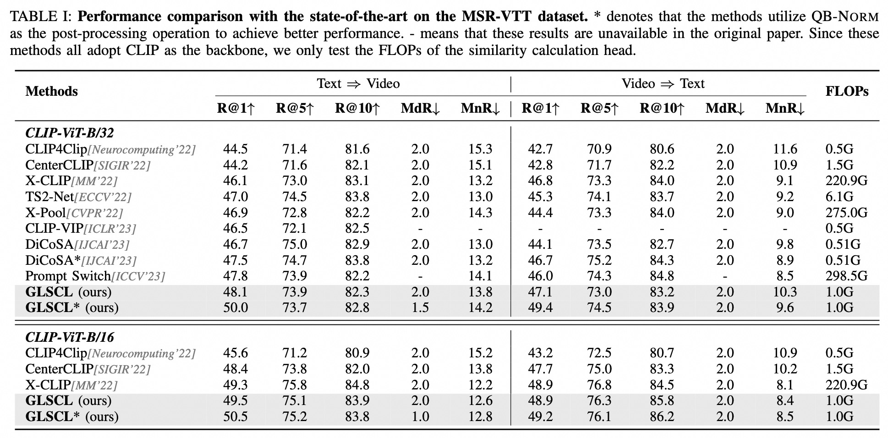
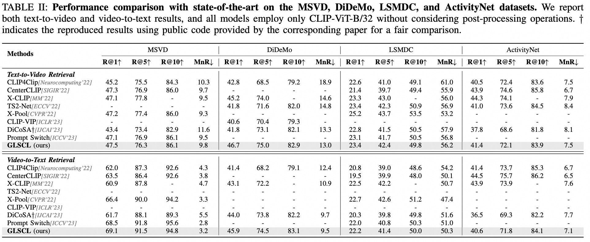

# _GLSCL_: Text-Video Retrieval with Global-Local Semantic Consistent Learning

<a href="https://zchoi.github.io/">Haonan Zhang</a>, <a href="https://ppengzeng.github.io/">Pengpeng Zeng</a>, <a href="https://lianligao.github.io/">Lianli Gao</a>, <a href="https://cfm.uestc.edu.cn/~songjingkuan/">Jingkuan Song</a>, Yihang Duan, <a href="https://xinyulyu.github.io/">Xinyu Lyu</a>, <a href="https://cfm.uestc.edu.cn/~shenht/">Heng Tao Shen</a>, 
</h4>
</div>

This is the official code implementation of the paper "Text-Video Retrieval with Global-Local Semantic Consistent Learning", the checkpoint and feature will be released soon.

## 🔥 Updates

- [ ] Release the pre-trained weight and datasets.
- [x] Release the training and evaluation code.

## ✨Overview
Adapting large-scale image-text pre-training models, e.g., CLIP, to the video domain represents the current state-of-the-art for text-video retrieval. The primary approaches involve transferring text-video pairs to a common embedding space and leveraging cross-modal interactions on specific entities for semantic alignment. Though effective, these paradigms entail prohibitive computational costs, leading to inefficient retrieval. To address this, we propose a simple yet effective method, Global-Local Semantic Consistent Learning (GLSCL), which capitalizes on latent shared semantics across modalities for text-video retrieval. Specifically, we introduce a parameter-free global interaction module to explore coarse-grained alignment. Then, we devise a shared local interaction module that employs several learnable queries to capture latent semantic concepts for learning fine-grained alignment. Moreover, we propose an inter-consistency loss and an intra-diversity loss to ensure the similarity and diversity of these concepts across and within modalities, respectively.

<p align="center">
    <br>
    <span><b>Figure 1. Performance comparison of the retrieval results (R@1) and computational costs (FLOPs) for text-to-video retrieval models.</b></span>
</p>


## 🍀 Method
<p align="center">
    <br>
    <span><b>Figure 2. Overview of the proposed GLSCL for Text-Video retrieval.</b></span>
</p>

## ⚙️ Usage
### Requirements
The GLSCL framework depends on the following main requirements:
- torch==1.8.1+cu114
- Transformers 4.6.1
- OpenCV 4.5.3
- tqdm

### Datasets
We train our model on ```MSR-VTT-9k```, ```MSVD```, ```DiDeMo```, ```LSMDC```, and ```ActivityNet``` datasets respectively. Please refer to this [repo](https://github.com/jpthu17/DiCoSA) for data preparation.

### How to Run (take *MSR-VTT* for example)

For simple training on MSR-VTT-9k with default hyperparameters:
```
bash train_msrvtt.sh
```
or run in the terminal directly:
```
CUDA_VISIBLE_DEVICES=4,5,6,7,8,9 \
python -m torch.distributed.launch \
--master_port 2513 \
--nproc_per_node=4 \
main_retrieval.py \
--do_train 1 \
--workers 8 \
--n_display 50 \
--epochs 5 \
--lr 1e-4 \
--coef_lr 1e-3 \
--batch_size 128 \
--batch_size_val 64 \
--anno_path /mnt/nfs/CMG/zhanghaonan/datasets/MSR-VTT/anns \
--video_path /mnt/nfs/CMG/zhanghaonan/datasets/MSR-VTT/MSRVTT_Videos \
--datatype msrvtt \
--max_words 32 \
--max_frames 12 \
--video_framerate 1 \
--output_dir ckpt/msrvtt/no_qbnorm/alpha0.0001_beta_0.02 \
--center 1 \
--temp 3 \
--alpha 0.0001 \
--beta 0.02 \
--query_number 8 \
--base_encoder ViT-B/32 \
--cross_att_layer 3 \
--query_share 1 \
--cross_att_share 1 \
--loss2_weight 0.5 \
```
### How to Evaluate (take *MSR-VTT* for example)

For simple testing on MSR-VTT-9k with default hyperparameters:
```
bash train_msrvtt.sh
```
or 
```
CUDA_VISIBLE_DEVICES=8,9 \
python -m torch.distributed.launch \
--master_port 2503 \
--nproc_per_node=2 \
main_retrieval.py \
--do_eval 1 \
--workers 8 \
--n_display 50 \
--epochs 5 \
--lr 1e-4 \
--coef_lr 1e-3 \
--batch_size 64 \
--batch_size_val 64 \
--anno_path /mnt/nfs/CMG/zhanghaonan/datasets/MSR-VTT/anns \
--video_path /mnt/nfs/CMG/zhanghaonan/datasets/MSR-VTT/MSRVTT_Videos \
--datatype msrvtt \
--max_words 32 \
--max_frames 12 \
--video_framerate 1 \
--output_dir ckpt/msrvtt/ablation/8query_intra_consistency_MSE_0.0001_inter_diversity_0.1margin_both_3cross_add_query_sim_query_shared_cross_att_shared_without_weight \
--center 1 \
--query_number 8 \
--cross_att_layer 3 \
--query_share 0 \
--cross_att_share 1 \
--add_query_score_for_eval 1 \
--base_encoder ViT-B/32 \
--temp 3 \
--alpha 0.0001 \
--beta 0.005 \
--init_model ckpt/msrvtt/ablation/8query_intra_consistency_MSE_0.0001_inter_diversity_0.1margin_both_3cross_add_query_sim_query_shared_cross_att_shared_without_weight/pytorch_model.bin.step2850.4 \
--loss2_weight 0.5 \
```


## 🧪 Experiments
<p align="center">

</p>

<p align="center">

</p>

## 📚 Citation

```bibtex
@inproceedings{GLSCL,
  author    = {Haonan Zhang and
              Pengpeng Zeng and
              Lianli Gao and
              Jingkuan Song and
              Yihang Duan and
              Xinyu Lyu and
              Hengtao Sheng
            },
  title     = {Text-Video Retrieval with Global-Local Semantic Consistent Learning},
  year      = {2024}
}
```
